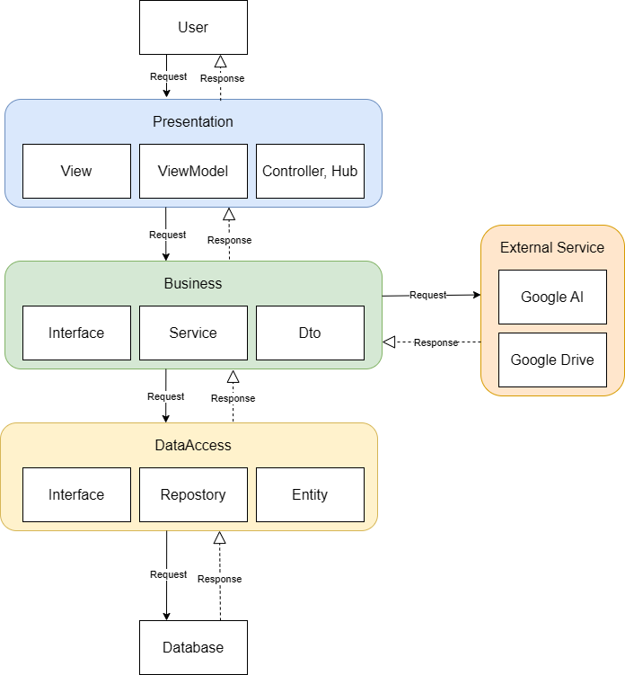

<div align="center">
  
  
  
  
</div>

<h1 align="center">🤖 RAG Chatbot — Hệ thống Chatbot Hỗ trợ Học tập</h1>

<p align="center">
  Ứng dụng Web áp dụng kỹ thuật <strong>RAG (Retrieval-Augmented Generation)</strong> cho phép sinh viên hỏi đáp tự nhiên và xem tài liệu dựa trên tài liệu môn học (PDF, DOCX). Bot chỉ trả lời trong phạm vi tài liệu được cung cấp và luôn kèm theo trích dẫn nguồn (tên file, số trang).
</p>

---

## 📑 Mục Lục
- [✨ Tính Năng Nổi Bật](#-tính-năng-nổi-bật)
- [🏗 Kiến Trúc Hệ Thống](#-kiến-trúc-hệ-thống)
- [🔄 Luồng Hoạt Động](#-luồng-hoạt-động)
- [📁 Cấu Trúc Thư Mục](#-cấu-trúc-thư-mục)
- [💡 Điểm Nổi Bật Kỹ Thuật](#-điểm-nổi-bật-kỹ-thuật)
- [🚀 Hướng Dẫn Cài Đặt](#-hướng-dẫn-cài-đặt)
- [📖 Hướng Dẫn Sử Dụng](#-hướng-dẫn-sử-dụng)
- [📚 Tài Liệu Chi Tiết](#-tài-liệu-chi-tiết)

---

## ✨ Tính Năng Nổi Bật

- 📚 **Quản lý Môn học & Tài liệu:** Tạo môn học và tải lên các tệp định dạng PDF/DOCX cho từng môn học riêng biệt.
- ⚙️ **Xử lý Ngầm (Background Job):** Tài liệu tải lên được tự động trích xuất, chia nhỏ (Local Semantic Chunking) và mã hoá thành vector trong nền. Hệ thống sử dụng thuật toán masking `ALPHANUMERICDOTMASK` để bảo toàn 100% các con số tài chính (ví dụ: `43.000`, `10.000.000`).
- 🔍 **Vector Search (pgvector):** Mỗi chunk được embedding thành vector 768 chiều lưu trong PostgreSQL. Tìm kiếm nhanh chóng bằng Cosine Similarity kết hợp với HNSW Index.
- ⚡ **REST API Chat:** Sử dụng kiến trúc REST API chuẩn mực để gọi và phản hồi tin nhắn từ AI một cách tin cậy.
- 🎯 **Trích Dẫn Thông Minh (Citations):** Cuối mỗi câu trả lời, Bot luôn chỉ rõ tên file và số trang đã dùng làm ngữ cảnh tham chiếu.
- 🕰 **Lịch sử Hội thoại:** Hệ thống lưu và tải lại lịch sử chat tự động theo từng phiên bản môn học.
- 📖 **Xem Tài Liệu Tích Hợp:** Sinh viên có thể trực tiếp xem chi tiết các tài liệu mà giảng viên đã tải lên ngay trên nền tảng.

---

## 🏗 Kiến Trúc Hệ Thống

Hệ thống được thiết kế theo mô hình **Clean Architecture (N-Tier)** đảm bảo tính mở rộng và dễ bảo trì. Các layer giao tiếp thông qua Dependency Injection (DI) theo một chiều.

<div align="center">
  
  <p><em>(Sơ Đồ Giao Tiếp Các Tầng Kiến Trúc)</em></p>
</div>

| Thành phần | Công nghệ |
|---|---|
| **Backend Framework** | ASP.NET Core MVC (.NET 8) |
| **Cơ sở dữ liệu** | PostgreSQL + `pgvector` (Docker) |
| **ORM** | Entity Framework Core |
| **AI / LLM** | Google AI Studio (`gemini-1.5-flash`) |
| **Embedding Model** | `text-embedding-004` (768 chiều) |

| **File Parsing** | `UglyToad.PdfPig` (PDF), `DocumentFormat.OpenXml` (DOCX) |
| **Text Chunking** | `Microsoft.SemanticKernel.Text.TextChunker` + Custom Numeric Masking |
| **Frontend** | Razor Views + Tailwind CSS + ViewModels |

---

## 🔄 Luồng Hoạt Động

Dưới đây là luồng hoạt động chính khi người dùng tương tác với hệ thống:

1. **Giao tiếp đầu vào:** Người dùng thao tác trên trình duyệt (Upload tài liệu hoặc Gửi tin nhắn chat).
2. **Tiếp nhận Yêu cầu:** Yêu cầu được gửi đến **Controllers** (như `ChatController`, `DocumentController`) để xử lý HTTP API.
3. **Gọi Tầng Business:** Tầng Presentation không trực tiếp xử lý mà ủy quyền cho các Services (như `IDocumentService`, `IAiService`) thực thi nghiệp vụ.
4. **Xử lý Background (Đối với Tài liệu):** 
   - `DocumentProcessingJob` thực hiện đọc và chia trang. Quét ngược thông minh để không cắt đôi các con số.
   - `TextChunkingService` mask các số thập phân/phân cách ngàn, chia nhỏ văn bản (chunking) và gửi đi embedding.
5. **Tầng Data Access:** Khi cần lưu lịch sử hoặc tìm kiếm Vector, Business Services sẽ gọi xuống `Repositories`. Các repositories sử dụng Entity Framework Core để query CSDL PostgreSQL.
6. **External APIs:** Hệ thống gọi API bên ngoài (Google AI Studio để sinh nội dung & tạo Embedding, Google Drive để đồng bộ hóa tệp).

---

## 📁 Cấu Trúc Thư Mục

Dự án tuân thủ chặt chẽ nguyên lý **Clean Architecture / N-Tier Architecture**.

```text
CHATBOTRAG
│
├── RagChatbot.Presentation/   # Tầng Giao diện & Điều hướng (Web MVC)
│   ├── Controllers/           # Xử lý HTTP requests

│   ├── ViewModels/            # Các DTO/ViewModel cho Razor Views
│   ├── Views/                 # Giao diện người dùng Razor HTML/CSS
│   ├── wwwroot/               # CSS, JS, hình ảnh, thư viện tĩnh...
│   └── Program.cs             # Cấu hình Middleware, DI Container
│
├── RagChatbot.Business/       # Tầng Xử Lý Nghiệp Vụ - Logic Layer
│   ├── DTOs/                  # Data Transfer Objects
│   ├── Interfaces/            # Định nghĩa Interface Services
│   ├── Mappings/              # Cấu hình AutoMapper
│   └── Services/              # Các Business Logic (Chat, AI, Vector Search)
│
└── RagChatbot.DataAccess/     # Tầng Truy Xuất Dữ Liệu - Data Access Layer
    ├── Data/                  # DbContext (Entity Framework Core)
    ├── EntityModels/          # Các thực thể CSDL (Document, ChatSession)
    ├── Interfaces/            # Các hợp đồng Repositories
    ├── Repositories/          # Triển khai thao tác với CSDL
    └── Migrations/            # Lịch sử Schema Database
```

---

## 💡 Điểm Nổi Bật Kỹ Thuật

### Hệ thống Chunking thông minh hai lớp bảo vệ
Dự án triển khai cơ chế **hai lớp bảo vệ** nghiêm ngặt cho tính toàn vẹn dữ liệu số (đặc biệt là tài chính):
1. **Lớp 1 — Page Boundary Protection:** Thuật toán quét ngược tự động bỏ qua các dấu chấm nằm giữa chữ số khi ghép nối text giữa các trang.
2. **Lớp 2 — Token Masking:** Trước khi đưa vào Sentence Splitter, các dấu chấm phân cách ngàn/thập phân được mã hóa thành `ALPHANUMERICDOTMASK`. Quá trình này giúp chunker không hiểu lầm số là kết thúc câu. Mask được giải mã ngay sau khi chia chunk hoàn tất.

---

## 🚀 Hướng Dẫn Cài Đặt

### 1. Cấu hình biến môi trường
Tạo file `.env` ở thư mục gốc (tham khảo `.env.example`):
```env
DB_CONNECTION_STRING=Host=localhost;Port=5432;Database=RagChatbotDb;Username=postgres;Password=Password123!
GOOGLE_API_KEY=your_google_ai_studio_api_key_here
```
*(Bạn có thể lấy API Key miễn phí tại [Google AI Studio](https://aistudio.google.com/apikey))*

### 2. Khởi động Database (Docker)
Chạy lệnh sau để khởi tạo PostgreSQL và cài đặt sẵn pgvector:
```bash
docker compose up -d
```

### 3. Chạy Ứng Dụng Web
Di chuyển vào thư mục Presentation và khởi động server:
```bash
cd RagChatbot.Presentation
dotnet run
```
*(Hệ thống sẽ tự động chạy EF Core Migration trong lần khởi động đầu tiên).*

### 4. Truy cập
Mở trình duyệt tại địa chỉ: `http://localhost:5000` (hoặc port mặc định hiển thị trong console).

---

## 📖 Hướng Dẫn Sử Dụng

1. Vào tab **Documents** 👉 Tạo môn học mới (VD: `Lập trình .NET`).
2. Upload file PDF/DOCX cho môn học. Trạng thái ban đầu là `Pending`.
3. Đợi vài giây để hệ thống ngầm phân tích và đánh chỉ mục vector. Refresh trang để thấy trạng thái `Indexed`.
4. Chuyển sang tab **Chat** 👉 Chọn môn học ở cột bên trái và bắt đầu hỏi đáp.
5. Để xem lại tài liệu chi tiết, sử dụng tính năng **Xem tài liệu** trực tiếp trên giao diện.

---

## 📚 Tài Liệu Chi Tiết

| Tài liệu | Mô tả chi tiết |
|-----------|--------|
| 📄 [**SYSTEM_FLOW.md**](./SYSTEM_FLOW.md) | Luồng hoạt động chi tiết: Document Ingestion & RAG Chat Flow |
| 🗄️ [**ENTITIES.md**](./ENTITIES.md) | Mô tả Entities, DTOs, ViewModels & cấu hình DbContext |
| 🛡️ [**SystemRule.md**](./SystemRule.md) | Đặc tả Quy tắc, Phân quyền hệ thống và Usecase |

<br>
<p align="center">
  Made with ❤️ by Team 2
</p>
